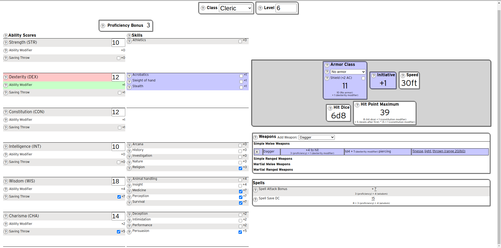

# Character Map
An editable recreation of a character sheet from the tabletop role-playing game Dungeons and Dragons.

The purpose of this project was to create an editable page that allows the user to see how changes to one number on their character sheet changes others. How inreasing their level will increase their proficiency bonus. Or how improving their dexterity score improves their dexterity modifier, which in turn increases their initiative bonus and, depending on their armour, their armor class (AC).

## Technologies
- react
- react-redux
- javascript
- HTML
- CSS
- git